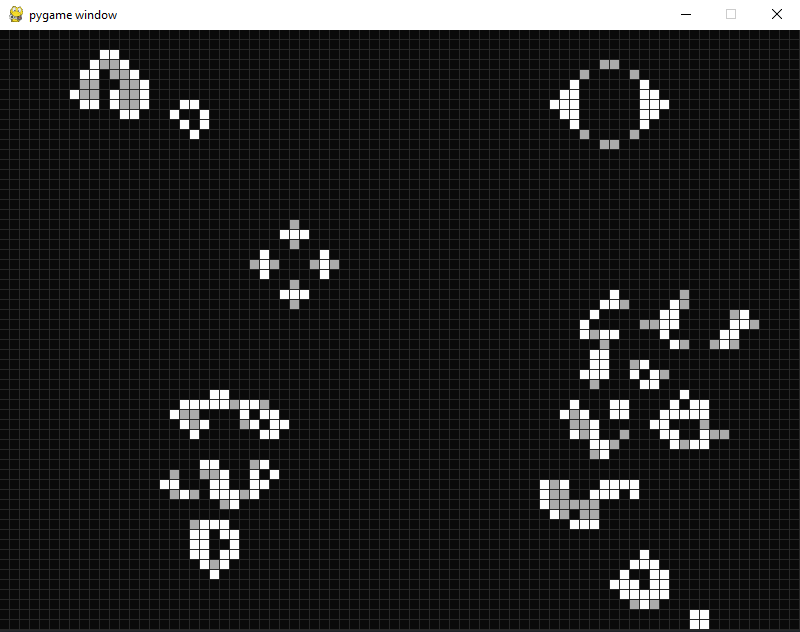

# Game of Life

- is a cellular automaton devised by the British mathematician John Horton Conway in 1970. It is a zero-player game, meaning that its evolution is determined by its initial state, requiring no further input. One interacts with the Game of Life by creating an initial configuration and observing how it evolves.

The game of life implemented in Python using PyGame.

https://en.wikipedia.org/wiki/Conway%27s_Game_of_Life